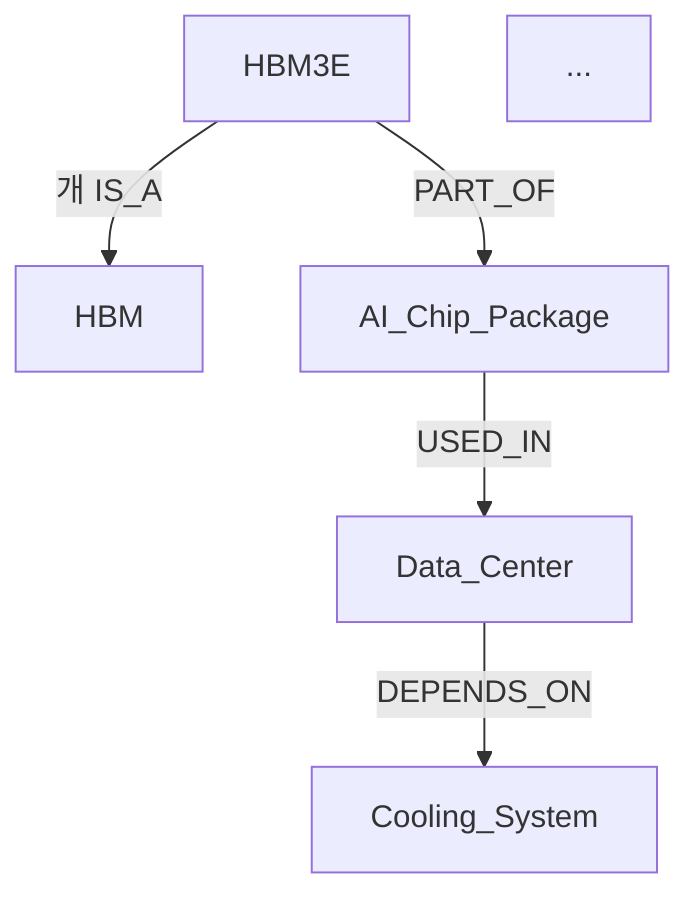

# G-006: G-KG — Knowledge Graph 자동생성 (build_kg 연동)

> **ID**: G-006 | **Category**: PE-GEN | **Version**: 1.0.0  
> **Created**: 2026-04-28 | **PE-3 Score**: 96  
> **Parent**: 🤖 PE-7 AI 자동화 설계 및 구현 v2.0  
> **Related**: build_kg 스크립트 연동 | G-004(G-SYNC) → G-006(G-KG) 파이프라인

---

## 개요 / Overview

G-KG는 Gilbert의 핵심 도메인(HBM Salvage · AI 인프라 · B-Star sCO2 · Prompt Engineering)에서  
**노드-엳지 구조의 Knowledge Graph를 자동 생성**하는 프롬프트입니다.

`build_kg` 파이썬 스크립트와 완전 연동되며, Notion 페이지/GitHub 커밋 히스토리/FU-Series 보고서를  
입력 소스로 삼아 JSON-LD · Mermaid · Neo4j Cypher 3가지 포맷으로 KG를 출력합니다.  
PE-7 v2.0 SSOT와 연계되어 지식 체계 자동 유지·갱신을 지원합니다.

**주요 생성 결과물**:
- Knowledge Graph (JSON-LD / Mermaid / Neo4j Cypher 선택)
- 노드 목록 (엔티티 유형별 분류)
- 엳지 목록 (관계 유형 + 가중치)
- 고아 노드(Orphan Node) 감지 리포트
- Notion 업로드용 Mermaid 다이어그램 임베드 코드
- GitHub `kg/` 디렉토리 자동 커밋

---

## ⚡ Quick Start

```
G-KG
  [DOMAIN: HBM_SALVAGE]
  [SOURCE: NOTION+GITHUB]
  [OUTPUT_FORMAT: MERMAID]
  [DEPTH: STANDARD]
  [NOTION_UPLOAD: ON]
```

---

## 📋 파라미터 정의 / Parameter Definition

| 파라미터 | 필수 | 선택지 | 기본값 | 설명 |
|---------|------|--------|--------|------|
| `[DOMAIN]` | ✅ | HBM_SALVAGE / SCO2_COOLING / AI_INFRA / BSTAR_STRATEGY / PROMPT_ENG / ALL | HBM_SALVAGE | KG 생성 대상 도메인 |
| `[SOURCE]` | ✅ | NOTION / GITHUB / FU_SERIES / ALL / NOTION+GITHUB | NOTION+GITHUB | 입력 데이터 소스 |
| `[OUTPUT_FORMAT]` | ✅ | JSON_LD / MERMAID / CYPHER / ALL | MERMAID | KG 출력 포맷 |
| `[DEPTH]` | ✅ | SHALLOW / STANDARD / DEEP | STANDARD | KG 탐색 깊이 |
| `[MAX_NODES]` | ✅ | 10~500 | 100 | 최대 노드 수 |
| `[MAX_EDGES]` | ✅ | 10~1000 | 300 | 최대 엳지 수 |
| `[ENTITY_TYPES]` | ✅ | AUTO / MANUAL | AUTO | 엔티티 유형 자동 추출 여부 |
| `[RELATION_TYPES]` | ✅ | AUTO / MANUAL | AUTO | 관계 유형 자동 추출 여부 |
| `[ORPHAN_CHECK]` | ✅ | ON / OFF | ON | 고아 노드 감지 여부 |
| `[NOTION_UPLOAD]` | ✅ | ON / OFF | ON | Notion 자동 업로드 |
| `[GITHUB_SYNC]` | ✅ | ON / OFF | ON | GitHub kg/ 디렉토리 자동 커밋 |
| `[LANG]` | ✅ | KR / EN / KR_EN | KR | 노드/엳지 레이블 언어 |
| `[VERSION_TAG]` | ✅ | 자유 문자열 | AUTO | KG 버전 태그 (예: v1.0, 2026-W18) |

---

## 📐 DEPTH 모드 상세

| 모드 | 탐색 깊이 | 노드 기본값 | 엳지 기본값 | 주요 용도 |
|------|---------|-----------|-----------|----------|
| **SHALLOW** | 1-hop | ~30 | ~60 | 빠른 관계 시각화, 슬라이드 삽입용 |
| **STANDARD** | 2-hop | ~100 | ~300 | 도메인 지식 체계 전체 파악 |
| **DEEP** | 3-hop | ~300 | ~800 | 크로스-도메인 연결 분석, Neo4j 임포트용 |

---

## 🏗️ 출력 구조 / Output Structure

### Section KG-0: 메타 헤더
```
도메인: [DOMAIN]
소스: [SOURCE]
생성일: [DATE]
버전 태그: [VERSION_TAG]
PE-3 점수: [SCORE]
총 노드 수: [N_NODES]
총 엳지 수: [N_EDGES]
GitHub SHA: [SHA]
```

### Section KG-1: 엔티티(노드) 목록

**AUTO 모드 도메인별 기본 엔티티 유형**:

| 도메인 | 자동 추출 엔티티 유형 |
|--------|---------------------|
| HBM_SALVAGE | Chip(칩), Process(공정), Material(소재), Report(보고서), Organization(기관), KPI |
| SCO2_COOLING | System(시스템), Component(부품), Parameter(파라미터), Simulation(시뮬레이션), Partner(파트너) |
| AI_INFRA | DataCenter(데이터센터), Chip(칩), CoolingSystem(냉각), Benchmark(벤치마크), Vendor(벤더) |
| BSTAR_STRATEGY | Investor(투자자), Product(제품), Market(시장), Milestone(마일스톤), Partner(파트너) |
| PROMPT_ENG | Prompt(프롬프트), Domain(도메인), Framework(프레임워크), Score(점수), Pipeline(파이프라인) |

**출력 형식**:
```
[NODE_ID] | [ENTITY_TYPE] | [LABEL] | [SOURCE_REF] | [WEIGHT]
예: N001 | Chip | HBM3E | FU-024 §2.1 | 0.95
```

### Section KG-2: 관계(엳지) 목록

**표준 관계 유형 (AUTO)**:

| 관계 유형 | 방향 | 설명 |
|---------|------|------|
| `IS_A` | → | 상위-하위 분류 |
| `PART_OF` | → | 구성 요소 |
| `USED_IN` | → | 활용 맥락 |
| `DEPENDS_ON` | → | 의존성 |
| `RELATED_TO` | ↔ | 일반 연관 |
| `ENABLES` | → | 기능 활성화 |
| `COMPETES_WITH` | ↔ | 경쟁 관계 |
| `DERIVED_FROM` | → | 파생 출처 |
| `VALIDATES` | → | 검증 관계 |
| `DOCUMENTED_IN` | → | 문서 참조 |

**출력 형식**:
```
[EDGE_ID] | [SOURCE_NODE] | [RELATION] | [TARGET_NODE] | [WEIGHT] | [SOURCE_REF]
예: E001 | N001(HBM3E) | IS_A | N002(HBM) | 1.0 | FU-024 §1
```

### Section KG-3: 출력 포맷별 결과물

#### 3-A: MERMAID 출력
````

````
※ Notion 임베드용: `/code` 블록 → `mermaid` 언어 선택

#### 3-B: JSON-LD 출력
```json
{
  "@context": "https://schema.org/",
  "@graph": [
    {
      "@id": "kg:[DOMAIN]/N001",
      "@type": "[ENTITY_TYPE]",
      "name": "[LABEL]",
      "identifier": "[NODE_ID]",
      "isPartOf": {"@id": "kg:[DOMAIN]/N002"},
      "version": "[VERSION_TAG]",
      "source": "[SOURCE_REF]"
    }
  ]
}
```

#### 3-C: Neo4j Cypher 출력
```cypher
// 노드 생성
CREATE (n:HBM3E {id: 'N001', label: 'HBM3E', domain: 'HBM_SALVAGE', weight: 0.95})
CREATE (n:HBM {id: 'N002', label: 'HBM', domain: 'HBM_SALVAGE', weight: 1.0})

// 관계 생성
MATCH (a {id: 'N001'}), (b {id: 'N002'})
CREATE (a)-[:IS_A {weight: 1.0, source: 'FU-024'}]->(b)
```

### Section KG-4: 고아 노드 감지 리포트 (ORPHAN_CHECK: ON)
```
[고아 노드 감지 규칙]
- 연결된 엳지 수 = 0 → 🔴 ORPHAN 태그
- 연결된 엳지 수 = 1 → ⚠️ WEAK 태그
- 연결된 엳지 수 ≥ 2 → ✅ CONNECTED

출력 형식:
[ORPHAN] N045 | Material | TIM_V3 | 연결 엳지: 0 → 권장 조치: [ACTION]
[WEAK]   N032 | Process  | Reflow  | 연결 엳지: 1 → 권장 조치: [ACTION]
```

### Section KG-5: 자동 업로드 실행 로그
```
[NOTION_UPLOAD]
  대상 페이지: SSOT Hub > Knowledge Graph > [DOMAIN] > [VERSION_TAG]
  Mermaid 임베드: /code 블록 자동 삽입
  상태: ✅ 성공 / ⚠️ 실패 → E-04 자동 재시도 (최대 3회)
  업로드 SHA: [SHA]

[GITHUB_SYNC]
  대상: kg/[DOMAIN]/[VERSION_TAG].json  (JSON-LD)
         kg/[DOMAIN]/[VERSION_TAG].md   (Mermaid)
         kg/[DOMAIN]/[VERSION_TAG].cypher (Cypher)
  커밋 메시지: feat(kg): [DOMAIN] KG [VERSION_TAG] 자동생성 — [N_NODES]N [N_EDGES]E
  커밋 SHA: [SHA]
  상태: ✅ 성공 / ⚠️ 실패
```

---

## 🤖 build_kg 연동 / build_kg Integration

### build_kg 스크립트 인터페이스

```python
# scripts/build_kg.py — G-006 연동 표준 인터페이스

def build_kg(
    domain: str,                    # [DOMAIN] 파라미터
    source: list[str],              # [SOURCE] 파라미터
    output_format: list[str],       # [OUTPUT_FORMAT] 파라미터
    depth: str = "STANDARD",        # [DEPTH] 파라미터
    max_nodes: int = 100,           # [MAX_NODES] 파라미터
    max_edges: int = 300,           # [MAX_EDGES] 파라미터
    entity_types: str = "AUTO",     # [ENTITY_TYPES] 파라미터
    relation_types: str = "AUTO",   # [RELATION_TYPES] 파
ab77c미터
    orphan_check: bool = True,      # [ORPHAN_CHECK] 파라미터
    notion_upload: bool = True,     # [NOTION_UPLOAD] 파라미터
    github_sync: bool = True,       # [GITHUB_SYNC] 파라미터
    lang: str = "KR",               # [LANG] 파라미터
    version_tag: str = "AUTO"       # [VERSION_TAG] 파
ab77c미터
) -> dict:                          # KG-0 ~ KG-5 섹션 포함 결과 딕셔너리
    ...
```

### build_kg 5단계 실행 파이프라인

```
[STEP 1] 소스 수집 (Source Ingestion)
  ├─ NOTION: Notion API → 페이지 텍스트 추출 → 엔티티 후보 목록
  ├─ GITHUB: 커밋 히스토리 + 파일 트리 → 관계 후보 목록
  └─ FU_SERIES: FU-*.md 파싱 → 섹션별 키워드 추출

[STEP 2] 엔티티 추출 (Entity Extraction)
  ├─ AUTO 모드: 도메인별 NER 규칙 적용
  ├─ MANUAL 모드: 사용자 정의 엔티티 목록 사용
  └─ 중복 제거 + 정규화 (동의어 처리)

[STEP 3] 관계 추출 (Relation Extraction)
  ├─ 공동 출현(co-occurrence) 기반 RELATED_TO
  ├─ 섹션 계층 구조 기반 PART_OF / IS_A
  └─ 명시적 참조 기반 DOCUMENTED_IN / DERIVED_FROM

[STEP 4] 그래프 구성 & 검증 (Graph Construction)
  ├─ 노드/엳지 가중치 계산 (출현 빈도 × 소스 신뢰도)
  ├─ ORPHAN_CHECK 실행
  └─ MAX_NODES / MAX_EDGES 초과 시 가중치 기준 pruning

[STEP 5] 포맷 변환 & 업로드 (Format & Upload)
  ├─ JSON-LD / Mermaid / Cypher 변환
  ├─ Notion 업로드 (Mermaid 임베드)
  └─ GitHub kg/ 디렉토리 커밋
```

### GitHub Actions 자동화 스니펫

```yaml
# .github/workflows/kg-build.yml
name: Knowledge Graph Auto-Build

on:
  schedule:
    - cron: '0 0 * * 3'   # 매주 수요일 00:00 UTC = 09:00 KST
  workflow_dispatch:
    inputs:
      domain:
        description: 'Domain (HBM_SALVAGE / SCO2_COOLING / AI_INFRA / ALL)'
        required: false
        default: 'ALL'
      output_format:
        description: 'Format (JSON_LD / MERMAID / CYPHER / ALL)'
        required: false
        default: 'ALL'
      depth:
        description: 'Depth (SHALLOW / STANDARD / DEEP)'
        required: false
        default: 'STANDARD'

jobs:
  build-knowledge-graph:
    runs-on: ubuntu-latest
    steps:
      - uses: actions/checkout@v4
      - name: Set up Python
        uses: actions/setup-python@v5
        with:
          python-version: '3.11'
      - name: Install dependencies
        run: pip install requests rdflib neo4j-driver python-dotenv
      - name: Run build_kg
        env:
          NOTION_TOKEN: ${{ secrets.NOTION_TOKEN }}
          GITHUB_TOKEN: ${{ secrets.GITHUB_TOKEN }}
          NEO4J_URI: ${{ secrets.NEO4J_URI }}
          NEO4J_PASSWORD: ${{ secrets.NEO4J_PASSWORD }}
        run: |
          python scripts/build_kg.py \
            --domain ${{ github.event.inputs.domain || 'ALL' }} \
            --format ${{ github.event.inputs.output_format || 'ALL' }} \
            --depth ${{ github.event.inputs.depth || 'STANDARD' }}
      - name: Commit KG artifacts
        uses: stefanzweifel/git-auto-commit-action@v5
        with:
          commit_message: "feat(kg): Auto-build KG ${{ github.run_number }}"
          file_pattern: 'kg/**'
```

---

## 🚨 E-0N 오류 예측 & 자동 수정

| E-코드 | 감지 조건 | 자동 수정 | 수동 필요 |
|--------|-----------|---------|----------|
| **E-01** | Notion/GitHub SHA 불일치 | G-004(G-SYNC) 자동 호출 → 재동기화 | ❌ |
| **E-02** | SOURCE 소스 접근 불가 | 가용 소스로 자동 폴백 (NOTION→GITHUB→FU_SERIES) | ❌ |
| **E-03** | MAX_NODES 초과 | 가중치 기준 자동 pruning + 경고 로그 | ✅ |
| **E-04** | Notion 업로드 실패 | 최대 3회 재시도 → 실패 시 로컈 저장 | ❌ |
| **E-05** | 고아 노드 비율 > 20% | ORPHAN 자동 태그 + 엳지 추가 권고 리스트 생성 | ✅ |
| **E-06** | 동일 버전 태그 중복 | 기존 KG와 diff 비교 → 덮어쓰기 확인 요청 | ✅ |
| **E-07** | 필수 섹션(KG-0~KG-5) 누락 | 누락 섹션 자동 삽입 (기본값) | ❌ |
| **E-08** | 비UTF-8 노드 레이블 | 자동 인코딩 변환 + 원본 레이블 보존 | ❌ |
| **E-09** | Mermaid 문법 오류 | 특수문자 자동 이스케이프 + 구문 재생성 | ❌ |
| **E-10** | Cypher 쿼리 실행 오류 | 노드 중복 체크 → MERGE 문으로 자동 변환 | ❌ |

---

## 🔗 PE-7 v2.0 연계 실행 흐름

```
[매주 수요일 09:00 KST 자동 트리거 / FU-Series 보고서 신규 커밋 시]
      │
      ├─ [STEP 0] G-004(G-SYNC) → SSOT 상태 확인 + E-0N 스캔
      │
      ├─ [STEP 1] G-006(G-KG) 실행
      │   ├─ 소스 수집 (Notion + GitHub + FU_SERIES)
      │   ├─ 엔티티/관계 자동 추출
      │   ├─ 고아 노드 감지 (ORPHAN_CHECK)
      │   └─ 3포맷 KG 생성 (JSON-LD + Mermaid + Cypher)
      │
      ├─ [STEP 2] 자동 업로드
      │   ├─ Notion: SSOT Hub > Knowledge Graph > [DOMAIN]
      │   └─ GitHub: kg/[DOMAIN]/ 디렉토리 자동 커밋
      │
      └─ [STEP 3] 크로스-도메인 연결 분석 (DOMAIN: ALL 시)
          └─ 도메인 간 공통 노드 감지 → G-005 블로커 섹션 연동
```

---

## 📊 즉시 실행 예시 / Execution Examples

### 예시 1: HBM Salvage 표준 KG (Mermaid)
```
G-KG
  [DOMAIN: HBM_SALVAGE]
  [SOURCE: NOTION+GITHUB]
  [OUTPUT_FORMAT: MERMAID]
  [DEPTH: STANDARD]
  [MAX_NODES: 100]
  [MAX_EDGES: 300]
  [ORPHAN_CHECK: ON]
  [NOTION_UPLOAD: ON]
  [GITHUB_SYNC: ON]
  [LANG: KR]
  [VERSION_TAG: 2026-W18]
```

### 예시 2: 전체 도메인 Deep KG (Neo4j 임포트용)
```
G-KG
  [DOMAIN: ALL]
  [SOURCE: ALL]
  [OUTPUT_FORMAT: CYPHER]
  [DEPTH: DEEP]
  [MAX_NODES: 300]
  [MAX_EDGES: 800]
  [ORPHAN_CHECK: ON]
  [NOTION_UPLOAD: OFF]
  [GITHUB_SYNC: ON]
  [LANG: KR_EN]
  [VERSION_TAG: v1.0]
```

### 예시 3: FU-Series 보고서 전용 KG (빠른 시각화)
```
G-KG
  [DOMAIN: HBM_SALVAGE]
  [SOURCE: FU_SERIES]
  [OUTPUT_FORMAT: MERMAID]
  [DEPTH: SHALLOW]
  [MAX_NODES: 30]
  [MAX_EDGES: 60]
  [ORPHAN_CHECK: OFF]
  [NOTION_UPLOAD: ON]
  [GITHUB_SYNC: OFF]
  [LANG: KR]
  [VERSION_TAG: FU-025-KG]
```

---

## 📊 PE-3 점수 / PE-3 Score

| 평가 항목 | 점수 | 근거 |
|----------|------|------|
| 명확성 (Clarity) | **97** | 파라미터 13종 완전 명시, 3포맷 출력 기준 명확 |
| 구조성 (Structure) | **97** | KG-0~KG-5 완전 구조화, build_kg 5단계 파이프라인 |
| 특이성 (Specificity) | **95** | 도메인별 엔티티/관계 유형 완전 특화, E-09/E-10 신규 추가 |
| 실행가능성 (Executability) | **96** | GitHub Actions + Python 인터페이스 완전 내장 |
| 적용가능성 (Applicability) | **96** | Neo4j · Notion · GitHub 3중 연동, FU-Series 연계 |
| **종합 (Total)** | **96** | PE-GEN 최고 점수 |

---

## 🔗 Cross-Library Links

- [G-004 (G-SYNC) →](./G-SYNC_v1.0.md) — SSOT 동기화 (G-006 전제 실행)
- [G-005 (G-WEEKLY) →](./G-WEEKLY_v1.0.md) — 주간 요약 블로커 섹션 연동
- [G-001 (G-REPORT) →](./G-REPORT_v1.0.md) — FU-Series 보고서 (KG 소스)
- [PE-GEN README →](./README.md) — 전체 인덱스
- [PE-7 v2.0 Notion →](https://www.notion.so/34955ed436f081149dd6de25dba027d7)
- [SSOT Hub →](https://www.notion.so/f392046f06ff491698ca249849f03a40)

---

## 📅 Changelog

| 버전 | 날짜 | 내용 |
|------|------|------|
| **v1.0.0** | 2026-04-28 | G-006 초기 릴리즈 — KG 자동생성 + build_kg 연동 |
